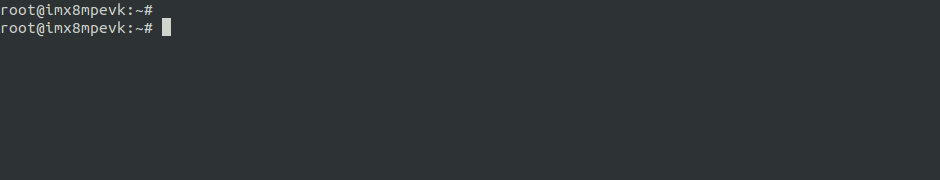

# PyeIQ

![Build][workflow-build] ![Unit Tests][workflow-tests] [![Gitter][gitter-image]][gitter-url] ![GitHub issues][license]

<h2 align="center">
  A Python Framework for eIQ on i.MX Processors
</h2>

  <a href="docs/Getting_Started_with_PyeIQ.md"><b>Getting Started</b></a> |
  <a href="docs/Docker.md"><b>Docker</b></a> |
  <a href="docs/Tables.md"><b>Examples</b></a> |
  <a href="docs/Contribute.md"><b>Contribute</b></a>

 
 

PyeIQ is written on top of [eIQ™ ML Software Development Environment][eiq]. Provides
a set of Python classes allowing the user to run Machine Learning applications in
a simplified and efficiently way without spending time on cross-compilations,
deployments or reading extensive guides.

### Official Releases

| **PyeIQ Version**     | **Release Date** | **i.MX Board** | **BSP Release** | **Building Status** | **Notes** |
|-----------------------|------------------|----------------|-----------------|---------------------|-----------|
| ![tag][tag_v1]        | April 29, 2020   | ![imx][boards] | ![BSP][release] | ![build][passing]   | PoC       |
| ![tag][tag_v2]        | Planned for June | -              | -               | -                   | -         |
| ![tag][tag_v3]        | Planned for Sept | -              | -               | -                   | -         |

### Installation for Users on i.MX Board

PyeIQ is hosted on [PyPI][pypirepo] repository referring to the latest tag on [CAF][pypicaf].

1. Use _pip3_ tool to install the package:

 

2. Find the installation at `/opt/eiq` folder. Use *--help* to learn how to run the sample applications.

### Samples

Check the available applications and demos at the table list located at `docs` folder.

| Object Classification (~3ms)   | Object Detection (~15ms)  |
|-------------------------------|--------------------------|
|   |  |

### Getting Started

For more details, please access the documents located at `docs` folder.

### Copyright and License

© 2020 NXP Semiconductors.

Free use of this software is granted under the terms of the BSD 3-Clause License.

[eiq]: https://www.nxp.com/design/software/development-software/eiq-ml-development-environment:EIQ
[workflow-build]: https://github.com/diegohdorta/pyeiq/workflows/Build/badge.svg
[workflow-tests]: https://github.com/diegohdorta/pyeiq/workflows/Unit%20Tests/badge.svg
[pypirepo]: https://pypi.org/project/eiq/#description
[pypicaf]: https://source.codeaurora.org/external/imxsupport/pyeiq/
[license]: https://img.shields.io/badge/License-BSD%203--Clause-blue
[gitter-url]: https://gitter.im/pyeiq-imx/community?utm_source=badge&utm_medium=badge&utm_campaign=pr-badge
[gitter-image]: https://badges.gitter.im/pyeiq-imx/community.svg
[boards]: https://img.shields.io/badge/-8QM%2C%208MPlus-lightgrey
[release]: https://img.shields.io/badge/-5.4.3__2.0.0-blueviolet
[tag_v1]: https://img.shields.io/badge/-v1.0.0-blue
[tag_v2]: https://img.shields.io/badge/-v2.0.0-blue
[tag_v3]: https://img.shields.io/badge/-v3.0.0-blue
[passing]: https://img.shields.io/badge/Build-passing-success
