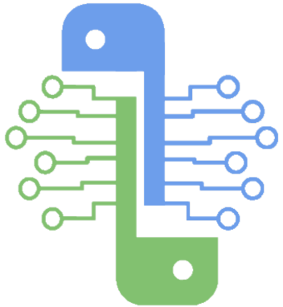

  

<h1 align="center">
<b>A Python Framework for eIQ on i.MX Processors</b>
</h1>

[PyeIQ][caf] is written on top of [eIQ™ ML Software Development Environment][eiq]
and provides a set of Python classes allowing the user to run Machine Learning
applications in a simplified and efficiently way without spending time on
cross-compilations, deployments or reading extensive guides.

                                           |
:--------------------------------------------------------------------------------------:  |
**Free and Open Source**: Framework under BSD-3-Clause fully extensible and customizable. |
**Ready-to-use**: Cutting-edge ML samples demonstrating full power of the of framework.   |

### **Samples**

| **Object Classification (~3ms)**       | **Object Detection (~15ms)**     |
|----------------------------------------|----------------------------------|
| ![oc][video_eIQObjectClassification]  | ![od][video_eIQObjectDetection] |

### **Official Releases**

| **PyeIQ Version**     | **Release Date** | **i.MX Board** | **BSP Release**        | **Status**         | **Notes** |
|-----------------------|------------------|----------------|------------------------|--------------------|-----------|
| ![tag][tag_v1]        | Apr 29, 2020     | ![imx][boards] | ![BSP][release_5.4.3_2.0.0]  | ![Build][passing]  | PoC       |
| ![tag][tag_v2]        | Jun 30, 2020     | ![imx][boards] | ![BSP][release_5.4.24_2.1.0]  | ![Build][passing]  | Stable    |

[video_eIQObjectDetection]: media/demos/eIQObjectDetection/video_eIQObjectDetection.gif
[video_eIQObjectClassification]: media/demos/eIQObjectClassification/video_eIQObjectClassification.gif

[caf]: https://source.codeaurora.org/external/imxsupport/pyeiq/
[eiq]: https://www.nxp.com/design/software/development-software/eiq-ml-development-environment:EIQ
[boards]: https://img.shields.io/badge/-8QM%2C%208MPlus-lightgrey
[release_5.4.3_2.0.0]: https://img.shields.io/badge/-5.4.3__2.0.0-blueviolet
[release_5.4.24_2.1.0]: https://img.shields.io/badge/-5.4.24__2.1.0-blueviolet
[tag_v1]: https://img.shields.io/badge/-v1.0.0-blue
[tag_v2]: https://img.shields.io/badge/-v2.0.0-blue
[passing]: https://img.shields.io/badge/Build-passing-success
